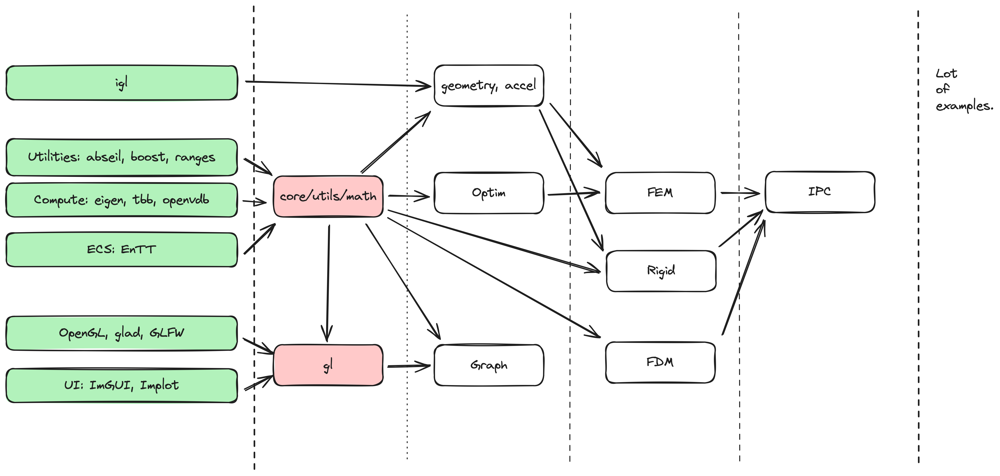
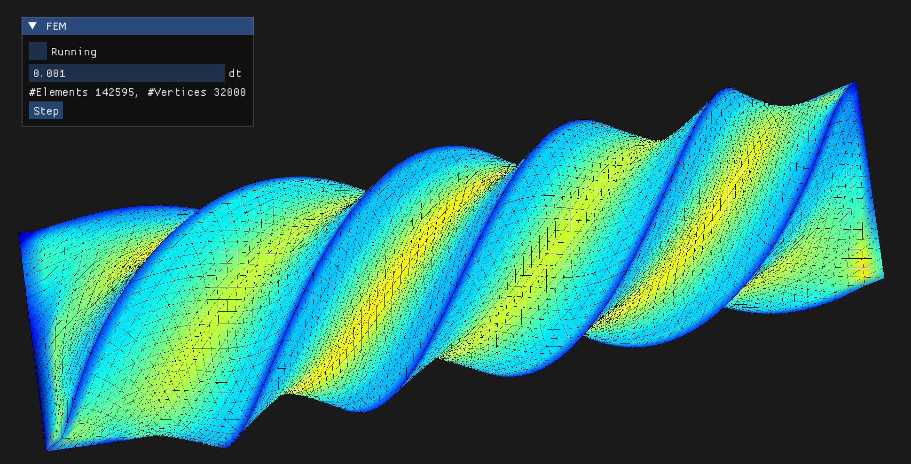

# axes

`axes` is a utility-library for Physical Simulation in Computer Graphics.



System Requirement:

- gcc>=12, or
- clang>=16.0, or
- MSVC: VS2022

`axes` use C++20 code standard.

## What's in

1. A basic library for general purpose CG physical simulation, containing
   1. Math library using Eigen;
   2. Utilities library, such as abseil's Status, Logging, Flags;
   3. A tiny optimization library
   4. Basic geometry functionalities
2. Graphics for visulization. which supports 
   1. Trimesh/line/point visualization (with phong shading)
   2. ImGUI integration.
   3. and something more...

## System Dependencies

Arch Linux:

```
yay -S libcap 
yay -S libcap gperf libsystemd
yay -S libmount
yay -S liblzma
yay -S clang15
yay -S xz dbus
# For OpenVDB
yay -S boost blosc tbb
```

# Performance Illustration



FEM-3D, with NeoHookean energy, naive L-BFGS optimizer. (Youngs=1e7, density=1e1, poisson ratio=0.3) solves 32000 vertices @24 steps per second.